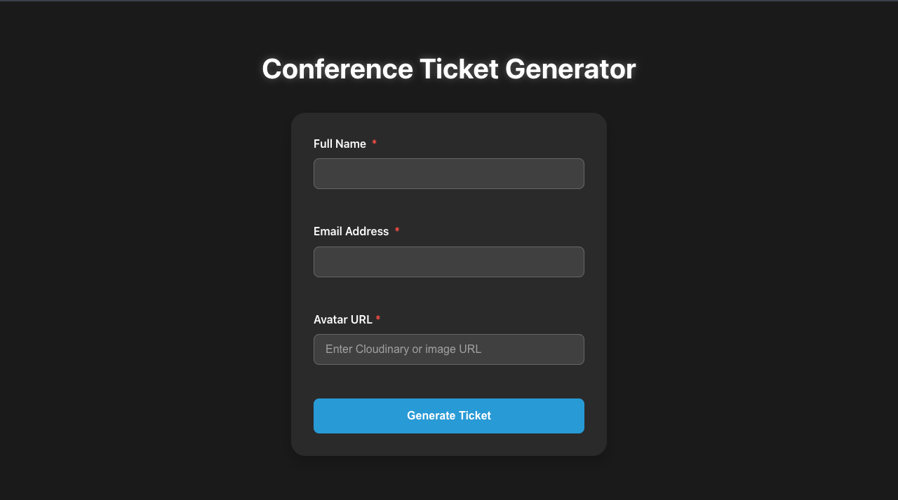

# React + Vite
# Conference Ticket Generator 🎟️

A modern, sleek, and user-friendly web application for generating professional conference tickets. Built with React and designed with accessibility in mind.



## 🌟 Features

- **Easy-to-Use Form**: Simple and intuitive interface for collecting attendee information
- **Real-Time Validation**: Instant feedback on input errors
- **Persistent Data**: Form data saved automatically to prevent loss of information
- **Responsive Design**: Works seamlessly on all devices
- **Accessible**: Built with WCAG guidelines in mind
- **Image Support**: Custom avatar upload through URL integration
- **Professional Tickets**: Clean, modern ticket design with QR code placeholder

## 🎯 Why Use Conference Ticket Generator?

### For Event Organizers
- **Save Time**: Automate the ticket generation process
- **Professional Look**: Consistent, branded tickets for all attendees
- **Reduce Errors**: Automated validation prevents common mistakes
- **Easy Management**: Digital tickets are easier to track and verify
- **Cost-Effective**: Eliminate the need for physical ticket printing
- **Eco-Friendly**: Reduce paper waste with digital tickets

### For Attendees
- **Instant Access**: Get tickets immediately after registration
- **Never Lose a Ticket**: Digital format ensures tickets are always accessible
- **Professional Presentation**: Clean, modern design looks great on any device
- **Easy to Share**: Digital format makes it simple to forward or show tickets
- **Always Available**: Access tickets anytime through any device

## 🚀 Getting Started

1. Clone the repository:
```bash
git clone https://github.com/yourusername/conference-ticket-generator.git
```

2. Install dependencies:
```bash
cd conference-ticket-generator
npm install
```

3. Start the development server:
```bash
npm run dev
```

4. Open [http://localhost:5173](http://localhost:5173) in your browser

## 🛠️ Built With

- **React** - Frontend framework
- **CSS3** - Styling with modern CSS features
- **Local Storage** - For data persistence
- **Vite** - Build tool and development server

## 📱 Mobile-First Design

Our ticket generator is built with a mobile-first approach, ensuring:
- Responsive layouts that work on all screen sizes
- Touch-friendly interface
- Optimized performance for mobile devices
- Seamless experience across all platforms

## 🔒 Security Features

- Form validation to prevent invalid data
- Secure image URL validation
- Data persistence using secure local storage
- Input sanitization for security

## 🎨 Customization

The ticket generator comes with:
- Customizable color schemes
- Flexible layout options
- Adaptable ticket designs
- Configurable form fields

## 💡 Use Cases

- **Tech Conferences**: Generate professional tickets for tech events
- **Business Seminars**: Create branded tickets for corporate seminars
- **Workshops**: Issue tickets for educational workshops
- **Meetups**: Distribute tickets for community gatherings
- **Webinars**: Send digital tickets for online events
- **Training Sessions**: Manage attendance for training programs

## 🤝 Contributing

We welcome contributions! Please see our [Contributing Guidelines](CONTRIBUTING.md) for details.

## 📄 License

This project is licensed under the MIT License - see the [LICENSE](LICENSE) file for details.

## 🙏 Acknowledgments

- React Team for the amazing framework
- All contributors who have helped shape this project
- The open-source community for continuous inspiration

## 📞 Support

Having issues? We're here to help!
- Create an issue in the repository
- Contact us through the issues section
- Check out our [FAQ](FAQ.md)

---

Made with ❤️ for the event community

This template provides a minimal setup to get React working in Vite with HMR and some ESLint rules.
Currently, two official plugins are available:

- [@vitejs/plugin-react](https://github.com/vitejs/vite-plugin-react/blob/main/packages/plugin-react/README.md) uses [Babel](https://babeljs.io/) for Fast Refresh
- [@vitejs/plugin-react-swc](https://github.com/vitejs/vite-plugin-react-swc) uses [SWC](https://swc.rs/) for Fast Refresh
